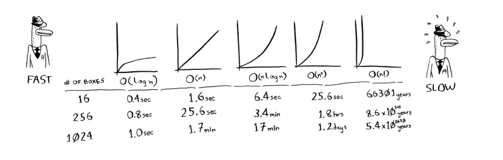

Big O notation (also means worst case run time)
- allows you to compare the number of operations 
- O(n) -> n number of steps needed 
- O (log n) -> log n number of steps 

Common Big 0 run times
1) O(log n) - log time, E.g binary search
2) O(n) - linear time, E.g simple search
3) O(n * log n) - fast sorting algorithm, E.g quick sort 
4) O(n ^ 2) - slow sorting algorithm, E.g selection srt
5) O(n!) - really slow algorithm, factorial time - E.g travelling sales person finding shortest route -> you check every possible order of route in the city 

• Binary search is a lot faster than simple search.
• O(log n) is faster than O(n), but it gets a lot faster once the list of items you’re searching through grows.
• Algorithm speed isn’t measured in seconds.
• Algorithm times are measured in terms of growth of an algorithm.
• Algorithm times are written in Big O notation.