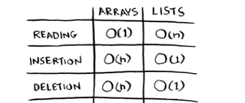

When it comes to memory
1 byte = 1 address

- For Array, we need one continuous block of memory E.g array size 5 --> it will do for example [1001][1002][1003][1004][1005] memory allocation to that arrya
- For LinkedList, nodes scattered across memory, so it could be stored anywhere, access is O(n)
  Say 1st node is [1001] second node is [1080], third node is [1040], fourth node is [1050], to access 5th node from 1st node, I need to jump from 1st to 2nd to 3rd to 4th to 5th
For this case, accessing Array is O(1) because with array we know the addresses of each element, and O(N) for LinkedList

!!! LinkedList is basically slower overall when compared with Array !!!
- So why do we use LinkedList? -> Insertion and deletion is fast, its O(1)
- Array insertion and deletion is O(n) because we need to shift elements
  If we delete an element in the middle, we have to shift else we break array logic
  [1001, 1002, null, 1004, 1005] this breaks logic, we need to shift
  [1001, 1002, 1004, 1005, null] - correct

QUestion
1) Why does it take O(n) time to insert an element into an array? ( Assuming theres extra space at the end )
   You need to shift all elements to the right to have first index empty before inserting

2) Inserting elements in the middle?
   List, all u need is ot change where the node points to, but for array u need to shift, and if theres no space u need to copy everything to a new location

3) Deleting an element
   List, just need to change what previous node points to

!!! Note: LinkedList insertion is O(1) only if you already have the pointer to the place of insertion, else it will still be O(N) !!! 
