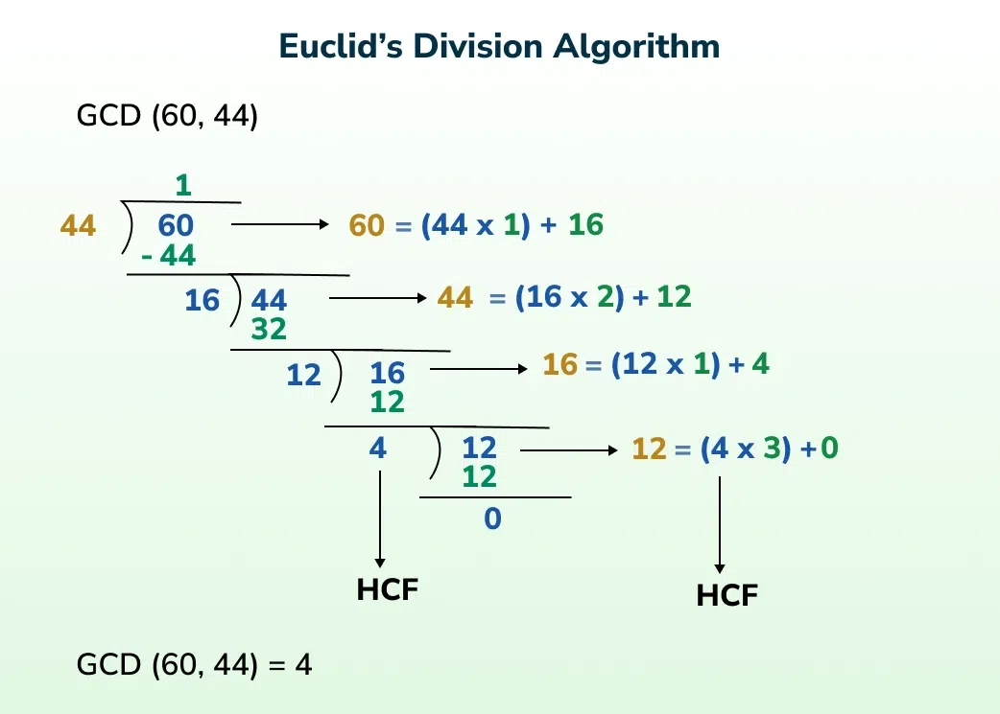
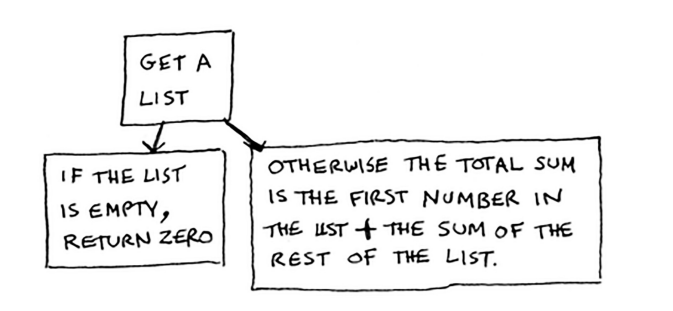
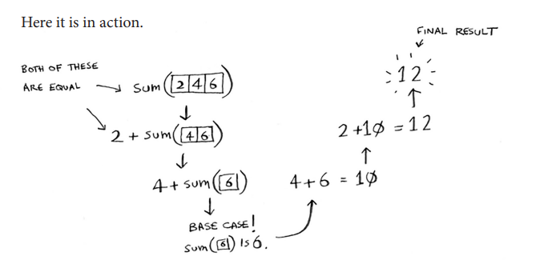

Divide and conquer are recursive algorithms 

- GCD is one of the simplest examples of divide and conquer.
- To find the greatest common divisor, we break it down → find the remainder, then have the previous divisor divide the remainder until the remainder is 0; the last non-zero divisor is the greatest common divisor.
- Fun fact: GCD is also known as the Euclid algorithm.

So how Divide and Conquer work is 
1) figure out a simple case as base case
2) Figure out how to reduce your problem and get to base case

Example - int[] arr = {2, 4,6};
Find total sum of the elements in array 
- You could do loop, thats pretty easy -> for (int i : arr) { sum += i } 

- But for recursive function, you will need to figure out the base case 
  - Whats the simplest array you could get 
  - simplest case -> if you have array of length <= 1, that'll be pretty easy. Base case for 0 elements is 0, Base case for 1 element, sum is that element itself
- We need to figure out how to move closer to an empty array with every recursive call, how to reduce problem size

- So its like having a recursion that returns the num, and we only stop until we hit the base case
int sum (int[] arr, i) {
  if (i == arr.length) {
    return 0;
  }
  return arr[i] + sum(arr, i + 1);
}
This is kinda overkill, sure, but its kind of a sneakpeak to functional programming since Functional programming languages like Hashell don't have loops 

[ 1, 2, 3, 4, 5]
- int findMax(int[] arr, int i) {
  if (i == arr.length - 1) {
  return arr[i];                 // base case: last element //5
  }

  int maxOfRest = findMax(arr, i + 1);
  return Math.max(arr[i], findMax(arr, i + 1));
  }
- 
- Binary Search is also a divide and conquer, we have 2 base case -> if element found, or if element not found (left > right)