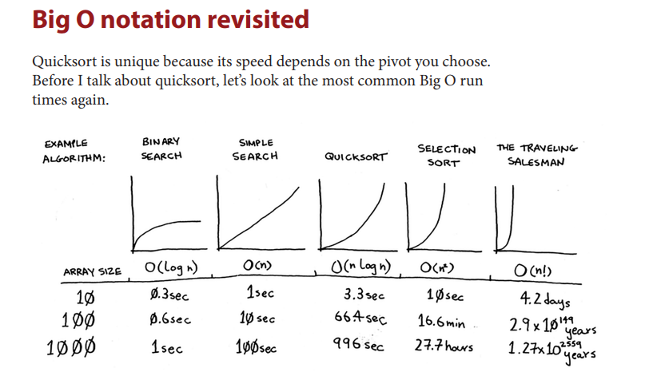

Quicksort is also a sorting algorith, faster than selection sort
- use divide and conquer 

-> If empty array or length == 1, don't need to sort array
So those are the base case 
if (arr.length < 2) { return arr }

- O (n ^ 2) time complexity
- O (log n) space complexity

General purpose data sorting on random int
In place,  very fast on average, cache friendly
- very fast because O(n ^ 2) is the worst case, and average case its O(n log n) 
- 
- learning mid pivot is enough tho 
Don't need auxiliary (temporary space ) like merge sort, but its O(log n) because of recursion

There's 3 partition ways

Lomuto partition
Hoare Partition
Three way partitioning

But we will learn Lomuto Middle to end partition only
We use left + ( right - left ) / 2 to get mid point
mid point set as pivot, swap it to the end ( always )
now we start from left and i is left
if left < pivot, we swap arr[left] with arr[i]
if swapped, i++. Else, we continue to explore
left (or j in the actual code) always increments
✔️ Swap happens only when arr[j] < pivot
so left always increase but i might/might not increase
Once that is done, we return the pivot back to a[i]
Now, we do subarray ( so same thing but left side of pivot )
and then right side of pivot
recursion basically

• D&C works by breaking a problem down into smaller and smaller
pieces. If you’re using D&C on a list, the base case is probably an
empty array or an array with one element.
• If you’re implementing quicksort, choose a random element as the
pivot. The average runtime of quicksort is O(n log n)!
• The constant in Big O notation can matter sometimes. That’s why
quicksort is faster than merge sort.
• The constant almost never matters for simple search versus binary
search, because O(log n) is so much faster than O(n) when your list
gets big.
