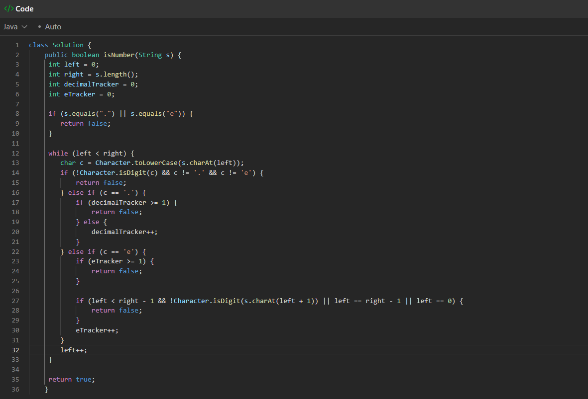

-- I tried this, it passed alot but still failed at like 1394/1498 test
-- Stopped because this was getting messy as I was adding more if validation to it 

So the cleaner pattern would be breaking down question into several components 
- While validating if its a valid num, we also need to take scientific notation into consideration
1) 1E + 3
this is a valid e because + is allowed after e, its optional sign 

class Solution {
public boolean isNumber(String s) {

        boolean digitSeen = false;
        boolean dotSeen = false;
        boolean eSeen = false;
        boolean digitAfterE = true;

        s = s.trim(); 

        for (int i = 0; i < s.length(); i++) {
            char c = s.charAt(i);

            if (Character.isDigit(c)) {
                digitSeen = true;
                if (eSeen) digitAfterE = true;
            }
            else if (c == '+' || c == '-') {
                // FIXED: added missing } here
                if (i > 0 && s.charAt(i - 1) != 'e' && s.charAt(i - 1) != 'E')
                    return false;
            }
            else if (c == '.') {
                if (dotSeen || eSeen) return false;
                dotSeen = true;
            }
            else if (c == 'e' || c == 'E') {
                if (eSeen || !digitSeen) return false;
                eSeen = true;
                digitAfterE = false;
            }
            else {
                return false;
            }
        }

        return digitSeen && digitAfterE;
    }