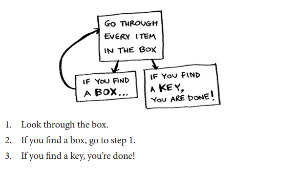

public Key findKeyInBox (final Box box) {
    if (box.containsKey()) {
        return box.getKey();
    } else if (box.containsMoreBox()) {
       return findKeyInBox(box.getInnerBox());
    }

    return null;
}

public static void main (String[] args) {
    for (Box box : MainBox) {
        Key key = findKeyInBox(box);

        System.out.println(key != null ? "Key Found" : "No Key");
    }
}

The Stack 
- Important concept for programming because recursion uses stack
- First in Last out 

public int factorial (int x) {
    if (x == 1) {
        return 1;
    }
    
    return x * fact(x-1);
}
So if we do factorial(5)

The stack builds like this:
factorial(5)
factorial(4)
factorial(3)
factorial(2)
factorial(1)

Then it returns like this:
factorial(1) → returns 1
factorial(2) → returns 2 * 1 = 2
factorial(3) → returns 3 * 2 = 6
factorial(4) → returns 4 * 6 = 24
factorial(5) → returns 5 * 24 = 120

factorial(5) is the first to enter, so it returns last.
So 5 runs and calls factorial(4), 4 runs and calls factorial(3)… all the way to factorial(1), and then 1 returns first.

!!! Recursion is convenient, but theres a cost - saving all the info takes memory !!!
- To solve this, you could rewrite your code using loop instead
- tail recursion (onyl some language supports it)

- So recursion is when a function calls itself 
- stack has push and pop 
- all function calls go to call stack 
- call stack can get very large, which takes alot of memory
- A recursive function that never stops will always cause a stack overflow, not infinite execution. (Once it hits stack limit, it errors out, java is ~1mb stack limit)

