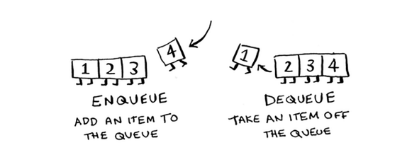
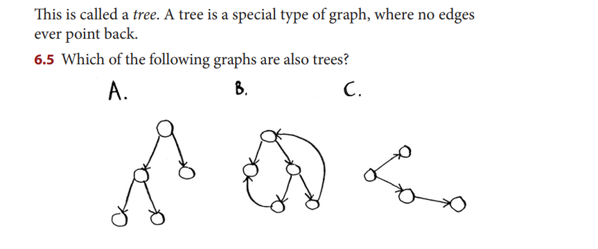

- With graph and knowledge to your first graph algorith; ie the breadth first search, you could do 
- 1) checker AI that calculates fewest moves to victory
- 2) Word spelling checker 
- 3) Find doctor closest to you in your network 

Graph models a set of connection, edges are the lines and vertices are the points  

Algorithm to solve the shortest path problem is -> Breadth First Search <- 
Breadth First Search can help answer 
1) Is there a path from node A to node B 
2) What is the shortest path from node A to node B 

Breadth first search uses queue -> Searches first level, queue the second level, once first level is done, searches second level, queues third level, so on and so forth

Before checking a person

Before checking, its important to make sure its not a visited node to avoid infinite loop -> add b , b adds c, c adds A, A adds b...Loop!!!
- To use Breadth first search, we need neighbor relationship, so it needs to be a structure that has connections, graph like structure 
- Trees
- Grids
- Linked structures
- Graphs :D

!!! A tree is a special type of graph, where no edges ever points back !!!

= A and C 

Recap : 
- BST tells us if theres a path from A to B 
- If there is a path, it tells you the shortest path ( not necessarily the fastest, but shortest)
- BFS works on both directed and undirected 

Now, if you want to find the fastest instead, we would use Dijkstra's algorithm 
- It only works if all edge weights are non negative 
- Meaning its only for weighted graphs, where each edge has a cost, like distance, time, weight, etc 
Lets see how it works with the graph 

- Find the cheapest node 
- Check whether theres a cheaper path to the neighbors of this node, if so, update cost 
- repeat until you've done this for every node in the graph 
- calculate final path 
!!! We dont explore all paths, we only explore nodes when they become the cheapest option

Breadth-first search is used to calculate the shortest path for
an unweighted graph.
• Dijkstra’s algorithm is used to calculate the shortest path for
a weighted graph.
• Dijkstra’s algorithm works when all the weights are positive.
• If you have negative weights, use the Bellman-Ford algorithm.

⭐ Does Dijkstra visit all nodes?

Yes and no — depending on what you mean.

✔️ If your goal is:

"Shortest path from A to EVERY node"
→ Yes, Dijkstra will eventually process every node.

✔️ If your goal is:

"Shortest path from A to just ONE node"
→ No, Dijkstra will stop early once it reaches that target.